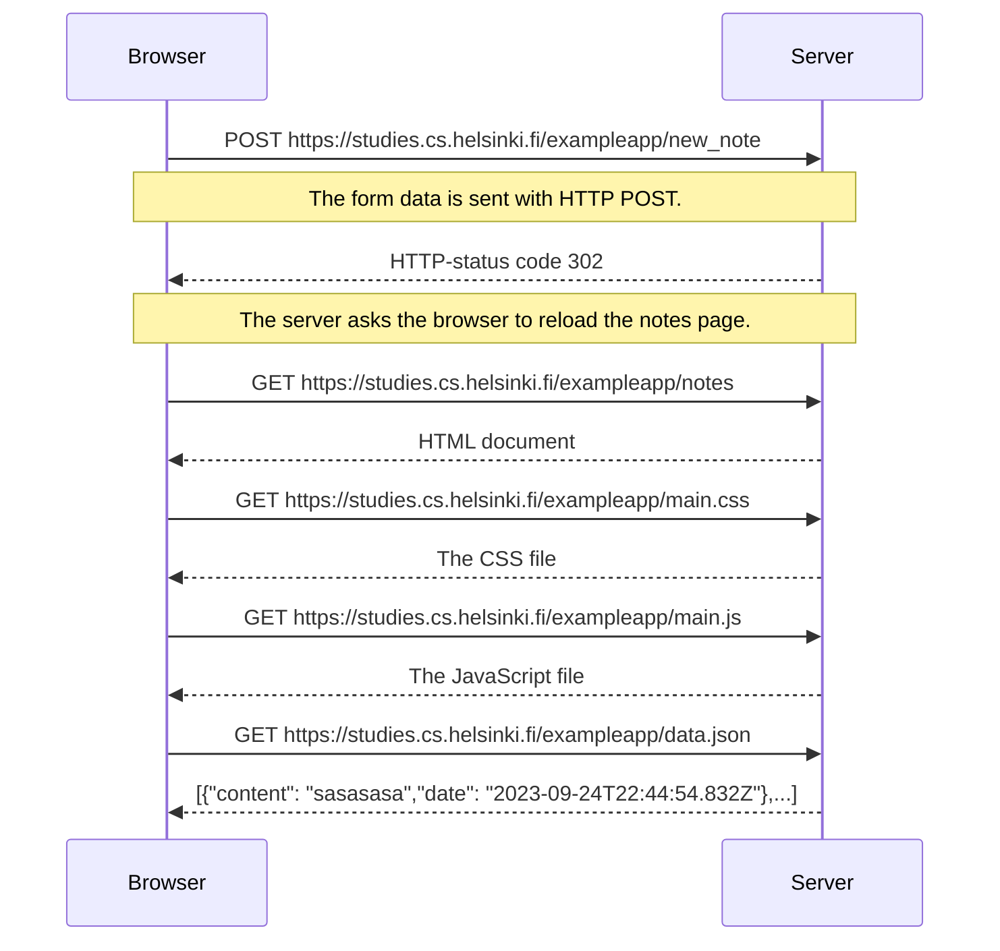

```mermaid
sequenceDiagram
    Browser->>Server: POST https://studies.cs.helsinki.fi/exampleapp/new_note
    Note over Browser,Server: The form data is sent with HTTP POST.
    Server-->>Browser: HTTP-status code 302
    Note over Browser,Server: The server asks the browser to reload the notes page.
    Browser->>Server: GET https://studies.cs.helsinki.fi/exampleapp/notes
    Server-->>Browser: HTML document
    Browser->>Server: GET https://studies.cs.helsinki.fi/exampleapp/main.css
    Server-->>Browser: The CSS file
    Browser->>Server: GET https://studies.cs.helsinki.fi/exampleapp/main.js
    Server-->>Browser: The JavaScript file
    Browser->>Server: GET https://studies.cs.helsinki.fi/exampleapp/data.json
    Server-->>Browser: [{"content": "sasasasa","date": "2023-09-24T22:44:54.832Z"},...]
```
